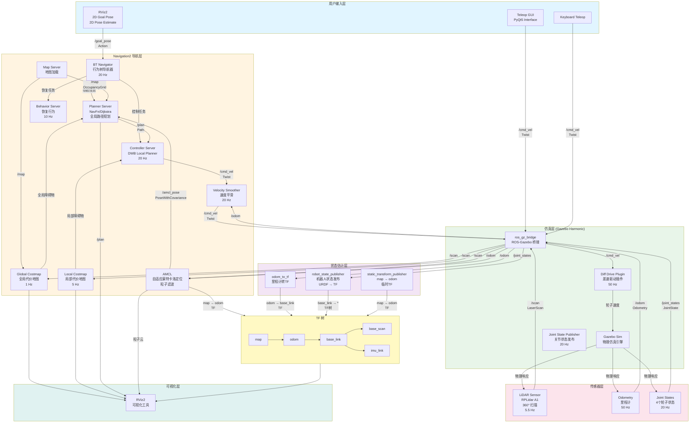
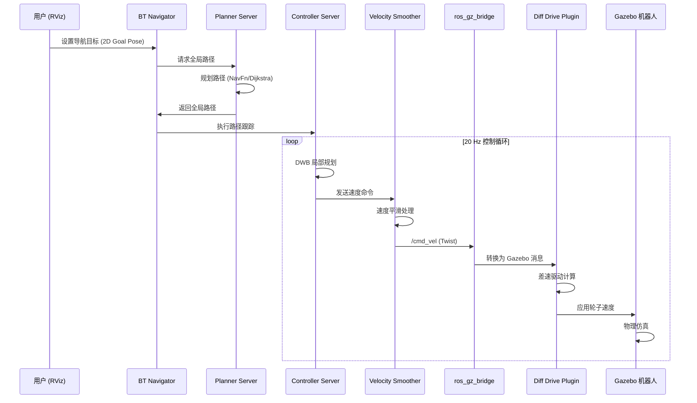
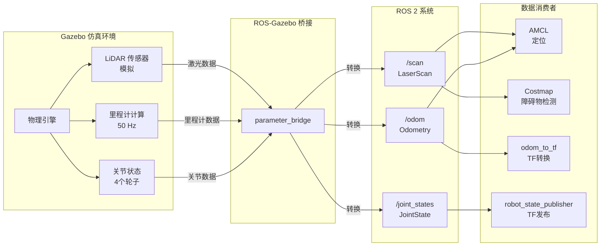
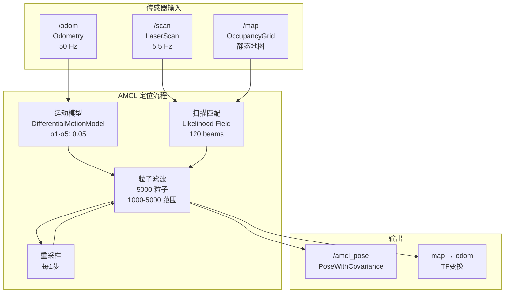
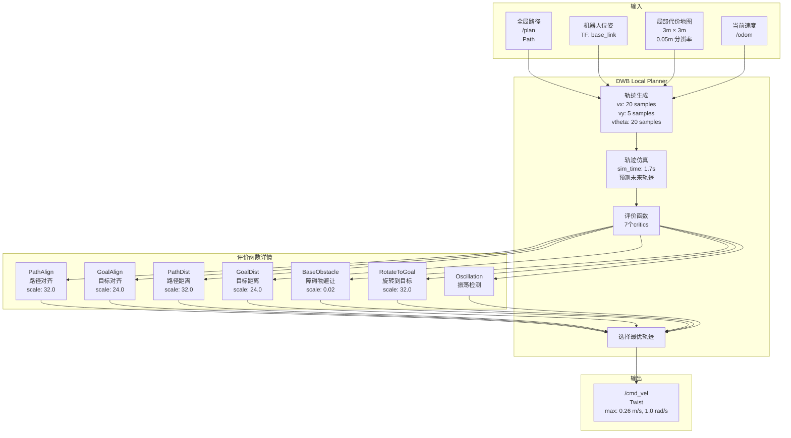
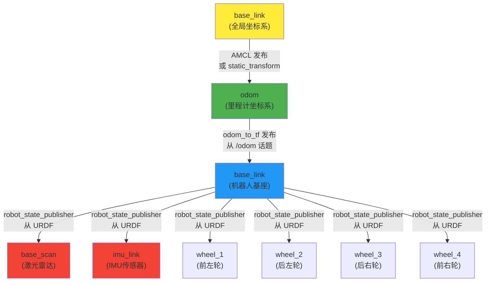

# Axioma 机器人系统控制框图

本文档基于现有代码实现，详细描述了 Axioma 机器人的完整控制架构和数据流。

---

## 系统总体架构



---

## 详细数据流图

### 1. 自主导航控制流



### 2. 传感器数据流



### 3. 状态估计和定位流



### 4. 局部路径跟踪控制流 (DWB)



### 5. TF 树结构



---

## 关键话题和消息类型

### 控制命令流

| 话题 | 消息类型 | 发布者 | 订阅者 | 频率 | 说明 |
|------|----------|--------|--------|------|------|
| `/cmd_vel` | `geometry_msgs/Twist` | Velocity Smoother / Teleop | ros_gz_bridge | 20 Hz | 速度控制命令 |
| `/plan` | `nav_msgs/Path` | Planner Server | Controller Server | 按需 | 全局路径 |
| `/goal_pose` | `geometry_msgs/PoseStamped` | RViz / BT Navigator | BT Navigator | 按需 | 导航目标 |

### 传感器数据流

| 话题 | 消息类型 | 发布者 | 订阅者 | 频率 | 说明 |
|------|----------|--------|--------|------|------|
| `/scan` | `sensor_msgs/LaserScan` | ros_gz_bridge | AMCL, Costmap | 5.5 Hz | 激光雷达扫描 |
| `/odom` | `nav_msgs/Odometry` | ros_gz_bridge | AMCL, odom_to_tf, Smoother | 50 Hz | 里程计数据 |
| `/joint_states` | `sensor_msgs/JointState` | ros_gz_bridge | robot_state_publisher | 20 Hz | 关节状态（4个轮子） |

### 状态估计流

| 话题 | 消息类型 | 发布者 | 订阅者 | 频率 | 说明 |
|------|----------|--------|--------|------|------|
| `/amcl_pose` | `geometry_msgs/PoseWithCovarianceStamped` | AMCL | Planner, RViz | 按需 | AMCL 估计位姿 |
| `/map` | `nav_msgs/OccupancyGrid` | Map Server | Planner, Costmap | 静态 | 占用栅格地图 |
| `/local_costmap/costmap` | `nav_msgs/OccupancyGrid` | Local Costmap | Controller, RViz | 2 Hz | 局部代价地图 |
| `/global_costmap/costmap` | `nav_msgs/OccupancyGrid` | Global Costmap | Planner, RViz | 1 Hz | 全局代价地图 |

### TF 变换

| 父框架 | 子框架 | 发布者 | 频率 | 说明 |
|--------|--------|--------|------|------|
| `map` | `odom` | AMCL / static_transform | 按需/静态 | 全局定位 |
| `odom` | `base_link` | odom_to_tf | 50 Hz | 里程计位姿 |
| `base_link` | `base_scan` | robot_state_publisher | 50 Hz | 激光雷达位置 |
| `base_link` | `imu_link` | robot_state_publisher | 50 Hz | IMU 位置 |
| `base_link` | `wheel_*` | robot_state_publisher | 50 Hz | 轮子位置 |

---

## 组件详细说明

### Navigation2 栈组件

#### 1. BT Navigator (行为树导航器)
- **功能**：协调整个导航流程
- **频率**：20 Hz
- **输入**：导航目标 (`/goal_pose`)
- **输出**：导航任务到 Planner 和 Controller
- **配置**：`nav2_params.yaml` lines 52-106

#### 2. Planner Server (全局路径规划)
- **功能**：从当前位置到目标位置的全局路径规划
- **算法**：NavFn (Dijkstra)
- **输入**：地图 (`/map`)、当前位姿 (AMCL)、目标位姿
- **输出**：全局路径 (`/plan`)
- **配置**：`nav2_params.yaml` lines 246-255

#### 3. Controller Server (局部路径跟踪)
- **功能**：局部路径跟踪和避障
- **算法**：DWB (Dynamic Window Approach)
- **频率**：20 Hz
- **输入**：全局路径 (`/plan`)、局部代价地图、当前速度
- **输出**：速度命令 (`/cmd_vel`)
- **配置**：`nav2_params.yaml` lines 108-169

#### 4. AMCL (自适应蒙特卡洛定位)
- **功能**：在已知地图中定位机器人
- **算法**：粒子滤波
- **粒子数**：1000-5000
- **输入**：激光扫描 (`/scan`)、里程计 (`/odom`)、地图 (`/map`)
- **输出**：估计位姿 (`/amcl_pose`)、TF (`map → odom`)
- **配置**：`nav2_params.yaml` lines 6-50

#### 5. Costmap (代价地图)
- **Global Costmap**：
  - 范围：整个地图
  - 更新频率：1 Hz
  - 用途：全局路径规划
- **Local Costmap**：
  - 范围：3m × 3m (滚动窗口)
  - 更新频率：5 Hz
  - 用途：局部避障
- **配置**：`nav2_params.yaml` lines 171-244

### 仿真层组件

#### 1. Gazebo Sim
- **功能**：物理仿真引擎
- **世界文件**：`empty.world` 或 `garage.world`
- **物理引擎**：Bullet/ODE

#### 2. ros_gz_bridge
- **功能**：ROS 2 和 Gazebo 之间的消息桥接
- **桥接话题**：
  - `/cmd_vel`: ROS → Gazebo
  - `/odom`: Gazebo → ROS
  - `/scan`: Gazebo → ROS
  - `/joint_states`: Gazebo → ROS
  - `/clock`: Gazebo → ROS
- **配置**：`simulation.launch.py` lines 68-79

#### 3. Diff Drive Plugin
- **功能**：差速驱动控制
- **频率**：50 Hz
- **输入**：`/cmd_vel` (Twist)
- **输出**：轮子速度、里程计 (`/odom`)
- **参数**：
  - 轮子半径：0.0381 m
  - 轮子间距：0.1725 m
  - 最大扭矩：20 N·m
  - 最大加速度：1.0 m/s²
- **配置**：`model.sdf` lines 404-419

### 状态估计组件

#### 1. odom_to_tf
- **功能**：将里程计消息转换为 TF 变换
- **输入**：`/odom` (Odometry)
- **输出**：TF `odom → base_link`
- **实现**：`axioma_gazebo/odom_to_tf.py`

#### 2. robot_state_publisher
- **功能**：根据 URDF 和关节状态发布 TF 树
- **输入**：URDF、`/joint_states`
- **输出**：TF 树 (`base_link → base_scan`, `base_link → imu_link`, `base_link → wheel_*`)

#### 3. static_transform_publisher
- **功能**：发布静态 TF 变换
- **用途**：临时 `map → odom` 变换（直到 AMCL 初始化）
- **配置**：`navigation_bringup.launch.py` lines 35-40

---

## 控制频率总结

| 组件 | 频率 | 说明 |
|------|------|------|
| Diff Drive Plugin | 50 Hz | 最高频率，直接控制轮子 |
| Odometry | 50 Hz | 里程计发布频率 |
| robot_state_publisher | 50 Hz | TF 树更新频率 |
| odom_to_tf | 50 Hz | TF 转换频率 |
| Controller Server | 20 Hz | 局部路径跟踪 |
| Velocity Smoother | 20 Hz | 速度平滑 |
| Joint State Publisher | 20 Hz | 关节状态发布 |
| Local Costmap | 5 Hz | 局部代价地图更新 |
| LiDAR | 5.5 Hz | 激光雷达扫描频率 |
| Global Costmap | 1 Hz | 全局代价地图更新 |
| Behavior Server | 10 Hz | 恢复行为 |
| AMCL | 按需 | 由里程计和扫描触发 |

---

## 数据流路径总结

### 控制命令路径
```
用户输入 (RViz/Teleop)
    ↓
BT Navigator
    ↓
Planner Server → 全局路径 (/plan)
    ↓
Controller Server (DWB)
    ↓
Velocity Smoother
    ↓
ros_gz_bridge
    ↓
Diff Drive Plugin
    ↓
Gazebo 物理引擎
    ↓
机器人运动
```

### 传感器数据路径
```
Gazebo 传感器
    ↓
ros_gz_bridge
    ↓
ROS 2 话题
    ├→ /scan → AMCL, Costmap
    ├→ /odom → AMCL, odom_to_tf, Smoother
    └→ /joint_states → robot_state_publisher
```

### 状态估计路径
```
传感器数据
    ↓
AMCL (粒子滤波)
    ↓
/amcl_pose + TF (map → odom)
    ↓
Planner Server (用于路径规划)
```

### TF 树构建路径
```
URDF + /joint_states
    ↓
robot_state_publisher
    ↓
TF: base_link → base_scan, imu_link, wheel_*

/odom
    ↓
odom_to_tf
    ↓
TF: odom → base_link

AMCL
    ↓
TF: map → odom
```

---

## 关键参数配置位置

| 参数类型 | 配置文件 | 位置 |
|----------|----------|------|
| Nav2 全局配置 | `nav2_params.yaml` | `src/axioma_navigation/config/` |
| DWB Controller | `nav2_params.yaml` | lines 131-169 |
| AMCL 定位 | `nav2_params.yaml` | lines 6-50 |
| Costmap 配置 | `nav2_params.yaml` | lines 171-244 |
| Gazebo 模型 | `model.sdf` | `src/axioma_gazebo/models/axioma_v2/` |
| 机器人 URDF | `axioma.urdf` | `src/axioma_description/urdf/` |
| 启动配置 | `navigation_bringup.launch.py` | `src/axioma_bringup/launch/` |

---

## 系统特性

### 优势
1. **模块化设计**：各组件独立，易于替换和调试
2. **实时性**：控制频率 20-50 Hz，满足实时控制需求
3. **鲁棒性**：多层避障（全局规划 + 局部避障）
4. **可扩展性**：支持插件化控制器（可替换 DWB）

### 限制
1. **无滑移补偿**：当前系统假设无滑移，实际滑移会影响定位精度
2. **无速度闭环**：Gazebo 插件直接应用速度命令，无 PID 控制
3. **固定参数**：所有参数需要手动调优

---

**文档版本**：1.0  
**最后更新**：2024-03-11  
**基于代码版本**：当前工作空间实现
